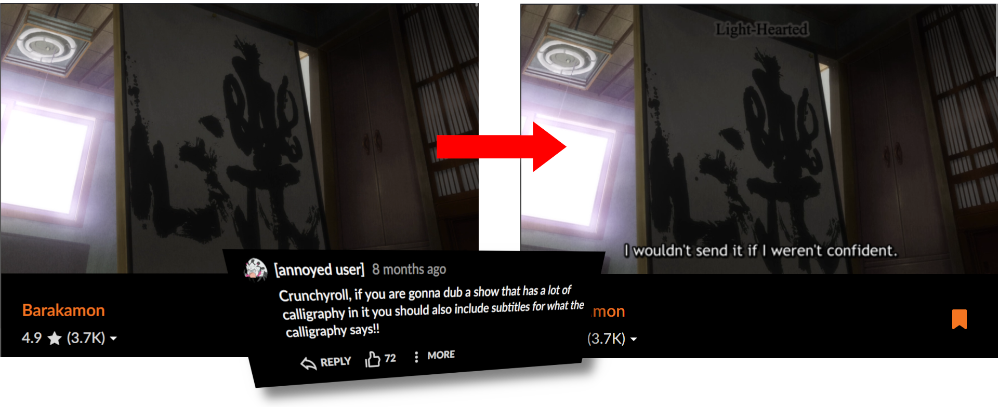

# Crunchyroll Subs on Dubs

A Firefox extension to add missing subtitles onto Crunchyroll dubs.

## Installation

Or, [install from Github](https://github.com/crsod/crsod/releases/latest).

## Usage

Set your Audio and Subtitles/CC in the Crunchyroll web player to your preferred languages.

If proper subtitles are not available on the dubbed video for the language you've
selected, they will be loaded from the original Japanese video instead.

## Known issues

### Subtitles don't match what I'm hearing

That's a common quirk of anime localization. Subs and dubs typically use
two slightly different translations.  As this addon is taking subtitles
from the subs and overlaying them on the dubs, you'll see these
differences.

### Subtitles appear too early/too late

Subs and dubs on Crunchyroll are two separate videos.
Sometimes these videos have timing differences (e.g. a few seconds of
production company logos inserted at beginning of one version and not the other).
This means subtitles taken from one version and applied to the other won't
match up.

This addon tries to fix the timing in such cases,
but this is based on heuristics and sometimes won't work.
